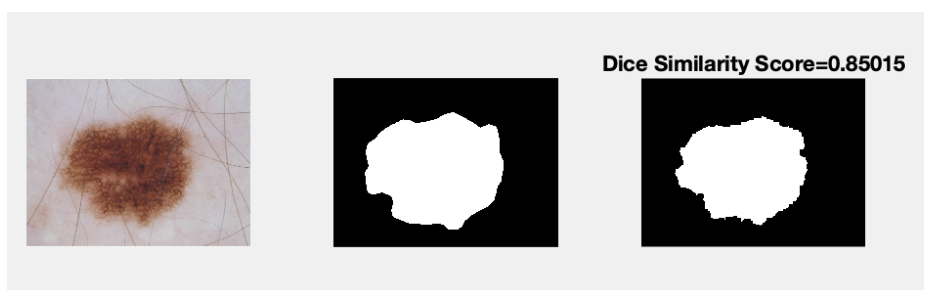

# Skin Lesion Segmentation by Thresholding

The RGB image is transformed to HSV. This is because, unlike RGB, HSV isolates colour intensity from a specific image's colour information. A thresholding process is used to binarize the image based on pixel intensities. The problem with the classic thresholding strategy is that it requires trial and error to choose a threshold. The thresholding approach of Otsu (1979) is used to automate the threshold selection. The method processes image histogram, segmenting the objects by minimization of the variance on each of the classes. The thresholding steps taken are as follow;
1. RGB images were converted to HSV color space.
2. Obtained image histogram distribution.
3. Calculated threshold value.
4. Changed image pixels into white in those regions, where saturation is greater than threshold and into the black in the opposite cases.
A morphological closing operation which dilate and erode is performed on the binary with a disk shaped element.

Figure 1 : Image ISIC_0000019, its ground truth and the segmentation outcome.

